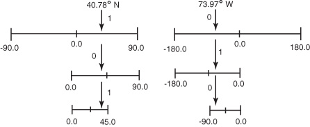
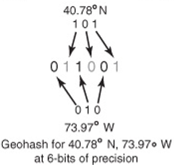
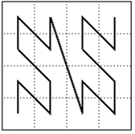
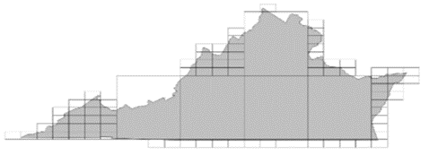

<!--

# Licensed to the Apache Software Foundation (ASF) under one
# or more contributor license agreements.  See the NOTICE file
# distributed with this work for additional information
# regarding copyright ownership.  The ASF licenses this file
# to you under the Apache License, Version 2.0 (the
# "License"); you may not use this file except in compliance
# with the License.  You may obtain a copy of the License at
#
#   http://www.apache.org/licenses/LICENSE-2.0
#
# Unless required by applicable law or agreed to in writing,
# software distributed under the License is distributed on an
# "AS IS" BASIS, WITHOUT WARRANTIES OR CONDITIONS OF ANY
# KIND, either express or implied.  See the License for the
# specific language governing permissions and limitations
# under the License.

-->
# Indexes

This section covers the optional indexes implemented in Apache Accumulo and MongoDB.  It covers how they are enabled, queried from an end user perspective, and the underlying architecture from a programmers perspective.

## Overview of indexing

The non-optional core indexes are SPO, POS, OSP.  These quickly find statements where any combination of one, two, or three of the subject, predicate, and object are known.  Also, since each of these core indexes contain the entire statement and context graph for all statements, each index acts as the repository for the entire RDF store.

Apache Rya has a variety of optional indexes that can be enabled.  

The optional indexes mostly focus on specific datatypes in the object, like temporal, geo, and text.  The object is the only part of an RDF statement that may be a literal data, for example, strings, dates and numbers.
Other indexes find groups of related statements as in the Geo-temporal, smarturi, and entity index.

The following is a list of the index projects. All are under the extras folder since they are optional: rya/extras/

The following sections cover indexes:

  - Entity
  - Freetext
  - Temporal
  - Reasoning
    - Backward Chaining
    - Forward Chaining
  - Geo
    - rya.geoindexing/geo.common
    - rya.geoindexing/geo.geomesa
    - rya.geoindexing/geo.geowave
    - rya.geoindexing/geo.mongo
  - shell

### Enabling Indexing
Each section will describe the how to enable its index.  There are two install methods for Rya that impact how indexes are configured:  
- legacy - on the fly configuration
- installer - persist configuraton in Rya instance Details


#### Legacy - on the fly configuration

The legacy method is not recommended for new Rya installations. It relies on the Rya driver code loading a consistent set of configuration data in memory from an XML file or setter methods. Most Rya features will detect missing persistent storage components and lazily create them.  This includes the core indexes and any optional indexes that are enabled in the configuration.  For example if one starts by connecting to new Accumulo installation with no tables, Rya will create the SPO, POS and OSP tables when they are needed.  This is not recommended because the configuration of the Rya application code can get out of sync with the backing database causing serialization errors and incomplete indexes. For example, if one run of Rya uses and maintains a Geo index, and a second run connects to the same backing store, and disables Geo indexing, the index will be missing any new statement insertions made in the second run.  

#### Installer - persisted RyaDetails

The installer method uses persistent storage to keep the configuration consistent.  Rya looks for a store: "RyaDetails" and overwrites the in-memory configuration.  RyaDetails is created using the install API, or using the administrative shell commands when Rya is first created.  Indexes can be created only at this time.  In contrast with the legacy method, all indexes enabled in the backing database will be maintained regardless of how a Rya application is configured.  See the following classes for details:

 - [RyaClientExample.java](https://github.com/apache/incubator-rya/blob/master/extras/indexingExample/src/main/java/RyaClientExample.java Github)
 - org.apache.rya.api.instance.RyaDetails,  
 - org.apache.rya.api.client.accumulo.AccumuloInstall
 - org.apache.rya.api.client.mongo.MongoInstall

### 1. Example Code: indexingExample

The [indexingExample](https://github.com/apache/incubator-rya/blob/master/extras/indexingExample Github) project contains complete code examples of the indexes using the Rya API directly, not the web-based interface.
The following are found in: extras/indexingExample/src/main/java

    RyaClientExample.java         -- install and manage a Rya instance.
    MongoRyaDirectExample.java    -- Several indexes for MongoDB
    RyaDirectExample.java         -- several indexes for Accumulo
    EntityDirectExample.java      -- Entity index    
    InferenceExamples.java        -- Inferencing
    ProspectorExample.java        -- Prospector usage
    StatementMetadataExample.java -- reified query with StatementMetadata


### 2. Index: Temporal
The temporal index quickly locates dates and times (instants) or ranges of contiguous instants (intervals) using an expression using temporal relations.  

#### Configuration
Temporal indexing is enabled in the installer configuration builder by setting
method `setUseAccumuloTemporalIndex()` to true.  For example:
```java
AccumuloIndexingConfiguration.builder().setUseAccumuloTemporalIndex(true);
```
When using Rya with the shell command: install-with-parameters, or in legacy (not recommended) set the configuration key:
```java
ConfigurationFields.USE_TEMPORAL = "sc.use_temporal"
```
to true, or method:
```java
ConfigUtils.getUseTemporal(conf);
```
##### Option: TEMPORAL_PREDICATES_LIST
To Limit the indexing of inserted statements particular predicates, set the following configuration key to a list of predicate URI's.
```java
    ConfigUtils.TEMPORAL_PREDICATES_LIST = "sc.temporal.predicates"
```
This key is not supported in the installer but can be used if the client specifies it per session.

#### Temporal Index Usage
Instants in the statement's object are xsd:date or xsd:datetime using any of the standard ways of formatting and some that are not so standard.  (See  OpenRdf's Literal.calendarValue() and org.joda.time.DateTime.parse())  The type is ignored as long as it is a RDF literal.  
For example temporal instant literals:

    2014-12-31T23:59:59-02:00
    2015-01-01T01:59:59Z
    2014-12-31T20:59:59-05:00
    2014-12-31

Note that the first three are the same date-time instant but from different time zones.  The index normalizes into time zone zero.

Intervals are expressed as [beginDatetime,endDatetime] where the two are temporal instant expressions formated as above.  For example, here is a one second interval, happy new year!:

    [2017-12-31T20:59:59-05:00,2017-12-31T21:00:00-05:00]

The following relations are supported.  The first column is the `FILTER` operation URI, the second a list of applicable temporal literals used as parameters in the `FILTER` expression.
```
PREFIX tempo: <tag:rya-rdf.org,2015:temporal#>
tempo:equals InstantEqualsInstant
tempo:before InstantBeforeInstant  InstantBeforeInterval
tempo:after  InstantAfterInstant   InstantAfterInterval
tempo:within InstantInsideInterval
TODO InstantHasBeginningInterval
TODO InstantHasEndInterval
```
In SPARQL, these are used in a `FILTER` clause in the `WHERE` for example:
```SPARQL
PREFIX tempo: <tag:rya-rdf.org,2015:temporal#>
    ...
WHERE {
    ...
FILTER( tempo:after(?time, '2001-01-01T01:01:03-08:00') ) .
}
```
#### Temporal Implementation Accumulo
Temporal under Accumulo is maintained in a single table.  Each statement that is indexed has four entries in the temporal table: O, SPO, SO and PO.  Where O is the object that is always a datetime, S is subject, and P is predicate.
Row Keys are in these two forms. Brackets denotes optional: [x] denotes x is optional:
   1. constraintPrefix datetime
   2. datetime 0x/00 uniquesuffix
 where
     constraintPrefix = 0x/00 hash([subject][predicate])
     uniquesuffix = some bytes to make it unique, like hash(statement).

The graph/context is handled as in the core indexes, using the
Index lookup is a matter of hashing zero, one or two of subject and predicate, and appending the datetime object, followed by a uniqueness suffix if the subject and predicate are omitted.

Injest will store a statement in the index if it meets the criterion: Object should be a literal, and one of the list validPredicates from the configuration.  If the validPredicates list is empty, accept all predicates.
If it does not meet the criteria, it is silently ignored.
It will Log a warning if the object is not parse-able.
It attempts to parse with OpenRdf's Literal.calendarValue() .
If that fails, tries: org.joda.time.DateTime.parse() .

#### Temporal Implementation MongoDB
MongoDB uses its native indexing on the core collection.

### 3. Index: Entity
Improves queries on **Entities**, also known as "star" queries, using the Accumulo's DocumentIndexIntersectingIterator.


#### Entity Configuration
Entity indexing is enabled in the installer configuration builder by setting
method `setUseAccumuloEntityIndex()` to true.  For example:
```java
AccumuloIndexingConfiguration.builder().setUseAccumuloEntityIndex(true);
```
When using Rya with the shell command: install-with-parameters, or in legacy (not recommended) set the configuration key:
```java
ConfigurationFields.USE_ENTITY = "sc.use_entity"
```
to true. Test with method:

```java
ConfigUtils.getUseEntity(conf);
```
##### Entity Options

There are no options for this index.

#### Entity Usage

This section covers two aspects of Entity indexing:  
   - The entity model API that allows containing an entity and it's properties, and
   - entity centric queries.

##### Entity API

An **Entity** is a named concept that has at least one defined structure
and multiple values that fit within each of those structures. A structure is
defined by a Type. A value that fits within that Type is a Property.

For example, suppose we want to represent a type of icecream as an Entity.
First we must define what properties an icecream entity may have:
```
                 Type ID: <urn:icecream>
              Properties: <urn:brand>
                          <urn:flavor>
                          <urn:ingredients>
                          <urn:nutritionalInformation>
```
Now we can represent our icecream whose brand is "Awesome Icecream" and whose
flavor is "Chocolate", but has no ingredients or nutritional information, as
an Entity by doing the following:

```java
  final Entity entity = Entity.builder()
              .setSubject(new RyaURI("urn:GTIN-14/00012345600012"))
              .setExplicitType(new RyaURI("urn:icecream"))
              .setProperty(new RyaURI("urn:icecream"), new Property(new RyaURI("urn:brand"), new RyaType(XMLSchema.STRING, "Awesome Icecream")))
              .setProperty(new RyaURI("urn:icecream"), new Property(new RyaURI("urn:flavor"), new RyaType(XMLSchema.STRING, "Chocolate")))
              .build();
```

The two types of Entities that may be created are **implicit** and **explicit**.
An implicit Entity is one who has at least one Property that matches
the Type, but nothing has explicitly indicated it is of  that Type.
Once that type is added to the entity, it is an **explicitly typed Entity**.

#### Entity Centric Queries

This is an example of a query that will be optimized by the Entity index:

```SQL
# Who does Carol work with, that is friends with Alice and carpools with Bob?
Select ?e
Where {
        :carol :worksWith ?e
        ?e :friends :Alice
        ?e :carPools :Bob     
}
# Shorthand form: :e1 :p1 ?e. ?e :p2 :v1; :p3 :v2.
```
Queries forms that benefit are:
    - Properties for an Entity (See the example above)
        ?e :p1 :e1. :e1 :p2  ?v1; :p3 ?v2.

    - Entity with Properties
        :e1 :p1 ?e.  ?e :p2 :v1; :p3 :v2.

    - “Friends of Friends”
        :e1 :p1 ?e.  ?e :p2 ?v; :p3 ?v2.

Another form of query is not improved by the index:

    - Unknown Intersection
        :e1 :p1 ?e. ?e ?p2 :v; ?p3 :v2.


#### Entity Architecture

Accumulo's `DocumentIndexIntersectingIterator` facilitates document-partitioned indexing.  The document in this case are the Entity's properties. It involves grouping (entity) a set of documents (properties) together and indexing those documents into a single row of an Accumulo table. This allows a tablet server to perform boolean `AND` operations on terms in the index.  For more information see the Accumulo documentation [Document-Partitioned Indexing in Accumulo.](https://accumulo.apache.org/1.6/accumulo_user_manual.html#_document_partitioned_indexing "Accumulo user manual")

A PDF presentation exists on the Rya wiki: [Entity Centric Indexing in Rya](https://cwiki.apache.org/confluence/display/RYA/Rya+Office+Hours)

### Index: Free Text
This index allows searching the words (terms) in stored RDF objects that contain text.  

#### Free Text Enable and Options
FreeText indexing is enabled in the installer configuration builder by setting
method `setUseAccumuloFreeTextIndex()` to true.  For example:

```java
AccumuloIndexingConfiguration.builder().setUseAccumuloFreetextIndex(true)
```

When using Rya with the shell command: install-with-parameters, or in legacy mode (not recommended) set the configuration key:

```java
ConfigurationFields.USE_FREETEXT = "sc.use_freetext"
```

to true. Test with method:

```java
ConfigUtils.getUseFreeText(conf);
```
##### FreeText Options

FreeText indexing two optional arguments.

######  Free Text  Option: FREETEXT_PREDICATES_LIST
To Limit the indexing of inserted statements particular predicates, set the following configuration key to a list of predicate URI's.

    ConfigUtils.FREETEXT_PREDICATES_LIST = "sc.freetext.predicates"

This key is not supported in the installer but can be used if the client specifies it per session.

It defaults to empty, which will match all predicates.

######  Free Text Option: FREE_TEXT_QUERY_TERM_LIMIT
The maximum number of terms allowed per query.
If a query contains more than this number, this IO error will be thrown:
```
Query contains too many terms.  Term limit: 999.  Term Count: 999
```
It defaults to 100 terms.

#### Free Text Usage
<!--
# TODO any of this syntax relevent?
#  https://www.elastic.co/guide/en/elasticsearch/reference/5.6/query-dsl-query-string-query.html#query-string-syntax
-->

*This section comes from the now defunct web site **opensahara.com** via the web archive: https://web.archive.org/web/20160303214007/https://dev.opensahara.com/projects/useekm/wiki/IndexingSail
*

Full text search (FTS) is done via the FILTER function `fts:text` .  For example:

```SQL
    PREFIX fts: <http://rdf.useekm.com/fts#>
    SELECT DISTINCT ?result WHERE {
      ?result rdf:label ?label.
      FILTER(fts:text(?label, "keyword"))
    }
```

The first argument to this function is the variable that will be filtered by an FTS. The second argument the FTS filter, and the optional third argument the full text search configuration that should be used. If you pass an FTS configuration (such as simple, dutch, english, etc.), it should match the configuration that was used for indexing the statements. The FTS filter currently supports:

Operator | Description
---------|-------------
& 	     | AND operator: search for multiple words that must occur, for example: `florence & machine & band`. This operator is the default, and can therefore be omitted. The following search is exactly the same: `florence machine band`
&brvbar; | OR operator: search for word varitions (only one word must occur), for example: `florence` &brvbar; `machine` &brvbar; `band`
* 	     | PREFIX search, for example: `floren*`

These operators can be combined, as in:

    floren* & band | singer

Use parentheses to change the order in which operators are evaluated, as in:

    floren* & (band | singer)

#### Free Text Architecture

##### Accumulo Free Text Architecture

The `AccumuloFreeTextIndexer` stores and queries "free text" data from statements into tables in Accumulo. Specifically, this class
stores data into two different Accumulo Tables. This is the <b>document table</b> (default name: triplestore_text) and the <b>terms
table</b> (default name: triplestore_terms).

The document table stores the document (i.e. a triple statement), document properties, and the terms within the document. This is the
main table used for processing a text search by using document partitioned indexing. See Accumulo class `IntersectingIterator`.

For each document, the document table will store the following information:

Row (partition) | Column Family  | Column Qualifier | Value
----------------|----------------|------------------|--------
shardID         | d\x00          | documentHash     | Document
shardID         | s\x00Subject   | documentHash     | (empty)
shardID         | p\x00Predicate | documentHash     | (empty)
shardID         | o\x00Object    | documentHash     | (empty)
shardID         | c\x00Context   | documentHash     | (empty)
shardID         | t\x00token     | documentHash     | (empty)


Note: documentHash is a sha256 Hash of the Document's Content

The terms table is used for expanding wildcard search terms. For each token in the document table, the table will store the following
information:


Row (partition)   | CF/CQ/Value
----------------- | -----------
l\x00token        | (empty)
r\x00Reversetoken | (empty)


There are two prefixes in the table, "token list" (keys with an "l" prefix) and "reverse token list" (keys with a "r" prefix). This table
is uses the "token list" to expand foo* into terms like food, foot, and football. This table uses the "reverse token list" to expand \*ar
into car, bar, and far.

Example: Given these three statements as inputs:

```
    <uri:paul> rdfs:label "paul smith"@en <uri:graph1>
    <uri:steve> rdfs:label "steven anthony miller"@en <uri:graph1>
    <uri:steve> rdfs:label "steve miller"@en <uri:graph1>
```

Here's what the tables would look like: (Note: the hashes aren't real, the rows are not sorted, and the partition ids will vary.)

Triplestore_text

Row (partition) | Column Family                   | Column Qualifier | Value
---------------|---------------------------------|------------------|----------
000000         | d\x00                           | 08b3d233a        | uri:graph1x00uri:paul\x00rdfs:label\x00"paul smith"@en
000000          | s\x00uri:paul                   | 08b3d233a        | (empty)
000000          | p\x00rdfs:label                 | 08b3d233a        | (empty)
000000          | o\x00"paul smith"@en            | 08b3d233a        | (empty)
000000          | c\x00uri:graph1                 | 08b3d233a        | (empty)
000000          | t\x00paul                       | 08b3d233a        | (empty)
000000          | t\x00smith                      | 08b3d233a        | (empty)
000000          | d\x00                           | 3a575534b        | uri:graph1x00uri:steve\x00rdfs:label\x00"steven anthony miller"@en
000000          | s\x00uri:steve                  | 3a575534b        | (empty)
000000          | p\x00rdfs:label                 | 3a575534b        | (empty)
000000          | o\x00"steven anthony miller"@en | 3a575534b        | (empty)
000000          | c\x00uri:graph1                 | 3a575534b        | (empty)
000000          | t\x00steven                     | 3a575534b        | (empty)
000000          | t\x00anthony                    | 3a575534b        | (empty)
000000          | t\x00miller                     | 3a575534b        | (empty)
000001          | d\x00                           | 7bf670d06        | uri:graph1x00uri:steve\x00rdfs:label\x00"steve miller"@en
000001          | s\x00uri:steve                  | 7bf670d06        | (empty)
000001          | p\x00rdfs:label                 | 7bf670d06        | (empty)
000001          | o\x00"steve miller"@en          | 7bf670d06        | (empty)
000001          | c\x00uri:graph1                 | 7bf670d06        | (empty)
000001          | t\x00steve                      | 7bf670d06        | (empty)
000001          | t\x00miller                     | 7bf670d06        | (empty)

triplestore_terms


Row (partition)   | CF/CQ/Value
------------------|------------
l\x00paul         | (empty)
l\x00smith        | (empty)
l\x00steven       | (empty)
l\x00anthony      | (empty)
l\x00miller       | (empty)
l\x00steve        | (empty)
r\x00luap         | (empty)
r\x00htims        | (empty)
r\x00nevets       | (empty)
r\x00ynohtna      | (empty)
r\x00rellim       | (empty)
r\x00evets        | (empty)

The query interface is based on the useekm library which use capability provided by Lucene/Elasticsearch

##### MongoDB Free Text Architecture
MongoDB backed Apache Rya implements free text indexing by creating a new collection whose name ends with "freetext".  Any statements ingested whose predicate is in the configured predicates are also inserted in this freetext collection, with the addition of the field "text".  The "text" field is assigned the statement's object.  A native MongoDB Text Index is created for the "text" field, as [described in the MongoDB documentation](https://docs.mongodb.com/manual/core/index-text/#create-text-index).

For queries, the search filter is described as the `$text` operator's [``$search` parameter in the MongoDB documentation ](https://docs.mongodb.com/manual/reference/operator/query/text/#op._S_text)

In contrast with the Accumulo backed FreeText filter, the MongoDB implementation treats spaces as `OR` operations. If the search string is a space-delimited string, the filter performs a logical `OR` for each term and returns documents that contains any of the terms.  The `phrase` approximates the `AND`: put each of the AND'ed terms inside there own double quotes, for example ``"toast" "bread"``.  [You can find examples.](https://stackoverflow.com/questions/23985464/how-to-and-and-not-in-mongodb-text-search/)  

The search expression: "\"ssl certificate\" authority key"

searches for the phrase "ssl certificate" and ("authority" or "key" or "ssl" or "certificate" ).


### Index: Geo
This index allows optimized searching for objects that are geo literals, Well Known Text (WKT) and Geospatial  Markup Language (GML).  

There are three immplementations of geo indexing in Rya:

  - rya.geoindexing/geo.geomesa

      Accumulo only using the [GeoMesa library](http://www.geomesa.org/)[3]

  - rya.geoindexing/geo.geowave

      Accumulo only using the [GeoWave library](https://locationtech.github.io/geowave/)[4]

  - rya.geoindexing/geo.mongo

      MongoDB only, using MongoDB's native support for geo.

[3] http://www.geomesa.org/

[4] https://locationtech.github.io/geowave/

To enable any of the Geo indexes, there three things you must do:
- build Rya with the geo profile
- use two replacement classes
- enable specific geo implementation in ConfigUtils

#### Building with the Geo profile
Any of the Geo implementations must be built since they use an incompatible license and so can not be distributed as part of an Apache project.  Use the profile '''geoindexing''' in the maven command:

    mvn clean install  -P geoindexing

This will set up the correct dependencies and build the geo jar.

#### Geo Sail and Optional Config Utils
The following two classes should be substituted when using a Geo indexe:

  - ```RyaSailFactory``` replace with: ```GeoRyaSailFactory```
  - ```ConfigUtils``` replace with: ```org.apache.rya.indexing.accumulo.geo.OptionalConfigUtils```

#### Geo Enable and Options

Geo indexing is enabled in the installer configuration builder by setting
method `setUse TODO Index()` to true.  For example:

```java
AccumuloIndexingConfiguration.builder().setUse TODO Index(true);
```

When using Rya with the shell command: install-with-parameters, or in legacy (not recommended) set the configuration key:

```java
OptionalConfigUtils.USE_GEO = "sc.use_geo"
```
For Mongo backed Rya, the above ```USE_GEO``` is enough.  If you intend to use the Accumulo backed Rya there are two geo implementations: GeoMesa and GeoWave.  GeoMesa is the default, so no further configuraton is needed. If you intend to use Accumulo with GeoWave, or you have a custom Geo implementation, set the `geo_indexer_type`:

```java
GEO_INDEXER_TYPE = "sc.geo.geo_indexer_type"
conf.set(OptionalConfigUtils.GEO_INDEXER_TYPE, GeoIndexerType.GEO_MESA.toString());
```
The built in geo_indexer_type's supported in Rya are:
```java
//  rya/extras/rya.geoindexing/geo.common/src/main/java/org/apache/rya/indexing/GeoIndexerType.java
public enum GeoIndexerType {
GEO_MESA("org.apache.rya.indexing.accumulo.geo.GeoMesaGeoIndexer"),
GEO_WAVE("org.apache.rya.indexing.accumulo.geo.GeoWaveGeoIndexer"),
MONGO_DB("org.apache.rya.indexing.mongodb.geo.MongoGeoIndexer"),
```

To Limit the indexing of inserted statements with particular predicates, set the following configuration key to a list of predicate URI's.

```java
OptionalConfigUtils.GEO_PREDICATES_LIST = "sc.geo.predicates"
```


##### Geo Option: ???

#### Geo Usage
##### Query Language Accumulo GeoMesa
GeoMesa is an Open Source Spatio-Temporal Indexing layer by CCRI.
It uses the GeoTools API, and an Accumulo storage Model.  the model stores RDF “Feature Type” with Subject, Predicate, Object, Context as “Attributes”
It stores this in a single table, using server side iterators.

It supports Geospatial “Simple Functions” in SPARQL filters:
Within, Equals, Disjoint, Intersects, Touches, Crosses, Contains, Overlaps
Well-know Text Representation:
Point, Linestring, Polygon 

The SPARQL Integration uses GeoSPARQL for storage and query.

##### GeoMesa Data Model
OpenGIS spatial features model
Features: points, lines, polygons
For example: Fire hydrant, river, political boundaries.

Features may have Attributes: Strings, numbers, and others.  For example: color, river flow rate, political state name.  GeoTools provides the DataStore interfaces and tools.

Submit Queries using GeoTools Filters (API: Filter Factory) translated from SPARQL filters. This is expressed using *Extended Common Query Language (ECQL)*

DataStore Implementation: Accumulo Data Layer
Single partitioned table
Server side iterators
Space Filling curve index
Geohashed spatial components

#### Geo Architecture
Space Filling Curve and GeoHashing

Interleave bits from Latitude and Longitude into Geohash string.  




The sequence of all strings form single dimensional curve that corresponds to the planet's surface.



Points nearby on surface are likely to be nearby on the curve.


Bounded areas can be decomposed into a list of geohash ranges, searched as Accumulo range scans.



=============template==============
### Index: ????
This index allows optimized searching ????.  

#### ???? Enable and Options
ConfigurationFields.USE_FREETEXT = "sc.use_freetext"
setUseAccumuloFreetextIndex(true)
##### ???? Option: ???
#### ???? Usage
#### ???? Architecture
